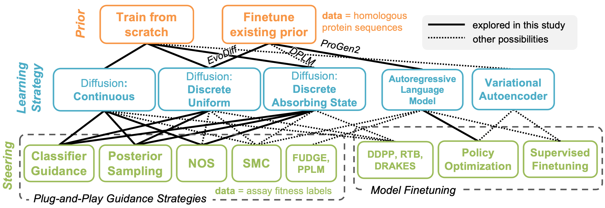

# Steered Generation for Protein Optimization (SGPO)

Repository for protein fitness optimization by guiding the generations from discrete diffusion models using various pretrained priors and guidance strategies, or finetuning autoregressive language models. Accompanies the [paper]() "Steering Generative Models with Experimental Data for Protein Fitness Optimization."

## Installation:
```
conda env create -f environment.yml
conda activate SGPO
```
Processed MSA sequences (for training the prior) and fitness data (for guidance) for TrpB and CreiLOV are preloaded in this repo under `data`. Raw data, pretrained model checkpoints, and experimental outputs can be downloaded from [huggingface](https://huggingface.co/jsunn-y/SGPO).

## Code Organization:
1. `configs/`: hydra config files for running experiments
2. `data/`: processed data files and code for data processing
3. `dataset/`: dataset objects for training value functions used in guidance
4. `exps/`: outputs from experiments, mainly generated sequences and associated fitness values
5. `models/`: diffusion models, denoising model architectures are provided in `models/pretraining/model/`
6. `oracle/`: oracle checkpoints for evaluating "ground truth" fitness and code for training and running the oracle
7. `sampling/`: code for sampling using various guidance algorithms
8. `scripts/`: shell scripts for running many experiments at once
9. `training/`: code for training the value functions used in guidance

## Model Pretraining:
Pretrained models are available on [huggingface](https://huggingface.co/jsunn-y/SGPO) and can be copied over into `checkpoints`. Alternatively, commands used to run pretraining are provided in `scripts/run_pretraining.sh`. Pretraining should take less than 1 hour for each diffusion model and several hours for each language model on a single H100. 

Example command:
```
python pretrain.py pretrain_model={pretrain_model} data={data}
```
- pretrain_model = `continuous`, `continuous_ESM`, `d3pm`, `d3pm_finetune`, `udlm`, `mdlm`, `causalLM_finetune`
- data = `TrpB`, `CreiLOV`

## Unconditional Sampling:
Commands to sample unconditionally from a pretrained prior without guidance are provided in `scripts/run_prior_sample.sh`. These samples are only mutated at the positions under study in the case of TrpB. Each command should take minutes on a single H100.

Example command:
```
python prior_sample.py pretrained_ckpt={pretrain_model}/{data} data={data} model={model}
```
- data = `TrpB`, `CreiLOV`
  
Supported prior models:
| Model| `pretrain_model` (checkpoint name) | `model` (prior model type) | 
|:----------:|:----------:|:----------------:|
| Continuous | `continuous` | `continuous` |
| Continuous over ESM embeddings | `continuous_ESM` | `continuous` |
| Discrete D3PM | `d3pm` | `d3pm` |
| Discrete D3PM (finetuned from EvoDiff) | `d3pm_finetune` | `d3pm` |
| Discrete UDLM | `udlm` | `udlm` |
| Discrete MDLM | `mdlm` | `mdlm` |
| Autoregressive Language Model (finetuned from ProGen2-Small) | `causalLM_finetune` | `causalLM` |

Output will be saved under `exps`: 
- `generated.fasta` with generated sequences.
- `summary.csv` samples generated over multiple rounds and repeats, with associated fitness values. Serves as a baseline.

Alternatively, sampling raw sequences with no post processing can be accomplished with example commands found in `scripts/run_uncond_sample.sh`.

### Perplexity Calculation
```python perplexity_calculation.py```
Calculates the perplexities of unconditionally generated sequences using ProGen2-base. Output will be saved to `exps/{data}/perplexity/perplexity.csv`.

## Guided Sampling:

Supported combinations of model and guidance strategy:
| Model| Guidance | `model` (prior model type) | `problem` (specifies how value function is trained) | `algorithm` (specifies sampling strategy) | 
|:---------:|:----------:|:----------------:|:------------:|:----------------:|
| Continuous | Classifier Guidance | `continuous` | `protein_classifier_continuous` |  `cls_guidance_continuous` |
| Continuous | DAPS | `continuous` | `protein_classifier_continuous` |  `daps_continuous` |
| Continuous | NOS | `continuous` | `protein_NOS_continuous` |  `NOS_continuous` |
| D3PM | Classifier Guidance | `d3pm` | `protein_classifier_discrete` |  `cls_guidance_discrete` |
| D3PM | DAPS | `d3pm` | `protein_classifier_discrete` |  `daps_discrete` |
| MDLM | Classifier Guidance | `mdlm` | `protein_classifier_discrete` |  `cls_guidance_discrete` |
| MDLM | DAPS | `mdlm` | `protein_classifier_discrete` |  `daps_discrete` |
| MDLM | NOS | `mldm` | `protein_NOS_discrete` |  `NOS_discrete` |
| Language Model | DPO | `causalLM` | `protein_DPO` |  `DPO` |

### Pareto Curve Experiment
Samples from guided generation, over multiple guidance strengths and multiple repeats, showing the tradeoff between having high diversity and high fitness. Example commands are given in `scripts/run_pareto.sh.` Each command should take less than one hour on a single H100.

Template command:
```
python pareto.py pretrained_ckpt={pretrain_model}/{data} data={data} model={model} problem={problem} algorithm={algorithm}
```

Output will be saved under `exps`:
 - `summary.csv` with generated sequences and associated fitness values.
  
### Iterative Adaptive Optimization Experiment
Using a fixed guidance strength, simulates batch "Bayesian optimization" over multiple rounds of guidance. An ensemble of value functions models is trained between each round, and "Thompson sampling" is used to select a value function for guiding each generated sampled. Commands are given in `scripts/run_iterative.sh`. Each command should take less than one hour on a single H100.

Template command:
```
python iterativeBO.py pretrained_ckpt={pretrain_model}/{data} data={data} model={model} problem={problem} algorithm={algorithm}
```

Output will be saved under `exps`:
 - `summary.csv` with generated sequences and associated fitness values.
 - value function model weights will be saved in `exps/.../models`

## Data Processing:
The processed data and oracle models needed to run downstream experiments are preloaded to this repository, but processing from raw data can be reproduced following the instructions below.

### Data for pretraining priors
[Jackhmmer](https://github.com/EddyRivasLab/hmmer/tree/master) was used to search for homologous proteins and generate a multiple sequence alignment (MSA). The steps to perform the Jackhmmer search and process the outputs is provided in `data/hmmer_processing.ipynb`. The inputs to this model are (1) a parent sequence as a target and (2) all sequences in Uniref90 (December 2024). Jackhmmer outputs have been uploaded to [huggingface](https://huggingface.co/jsunn-y/SGPO).

### Fitness data
Raw fitness data were downloaded from the [CreiLOV](https://pubs.acs.org/doi/10.1021/acssynbio.2c00662) and [TrpB](https://www.pnas.org/doi/10.1073/pnas.2400439121) datasets, respectively, and have been uploaded to [huggingface](https://huggingface.co/jsunn-y/SGPO). These data were normalized and processed using the steps provided in `data/process_fitness.ipynb`.

### Oracle training:
Pretrained oracles are uploaded to `oracle/checkpoints`. Alternatively, oracle training can be reproduced with the command
```
python oracle/train_oracle.py
```
Visualizations for evaluating the oracle: `oracle_analysis.ipynb`

## Analysis and Visualization:
Outputs from the experiments demonstrated in our paper can be downloaded from [huggingface](https://huggingface.co/jsunn-y/SGPO/tree/main) to replace the `exps` directory. Visualizations are provided in `analysis.ipynb`.

### Random baseline:
Generates random samples for downstream analysis.
```
python baseline_sample.py
```
